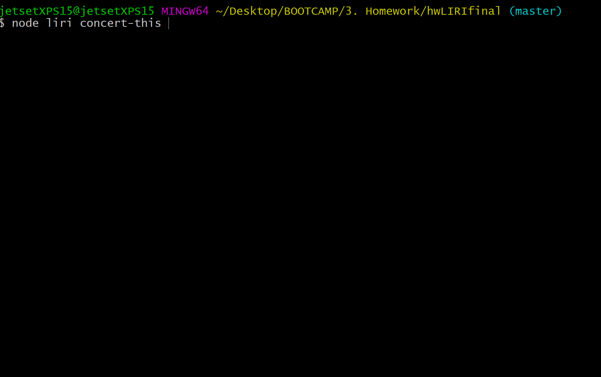
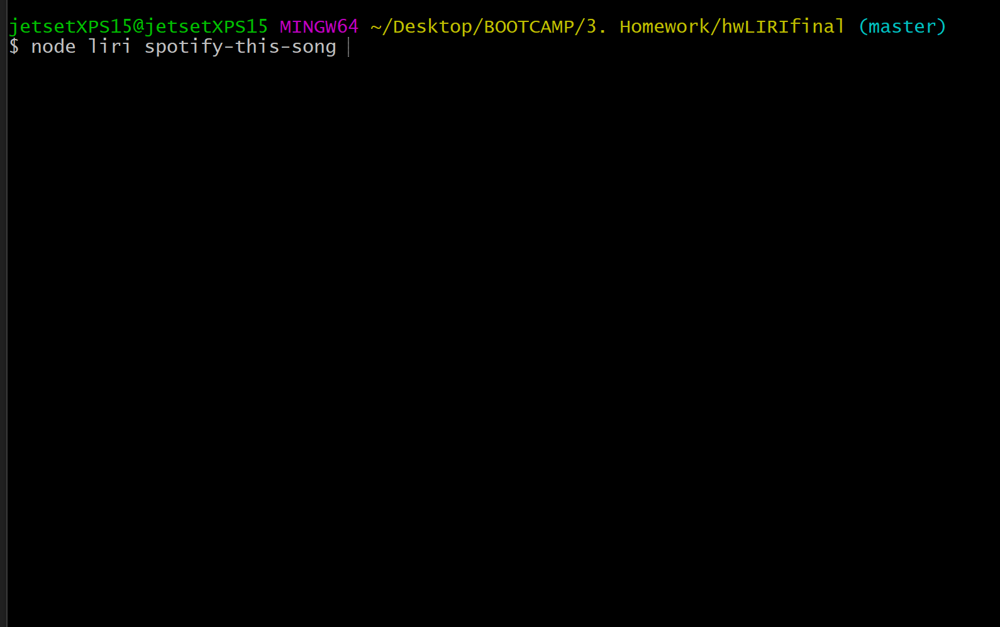
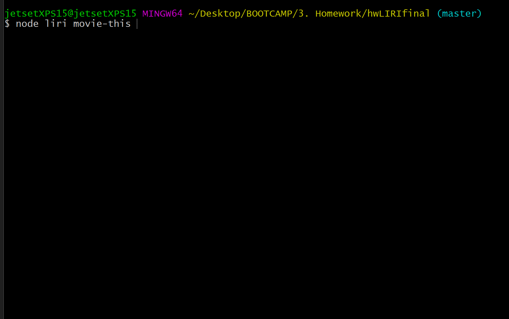
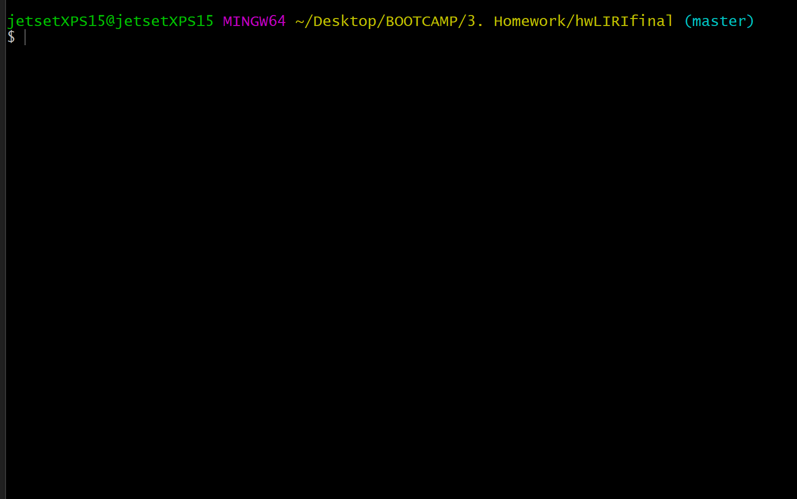
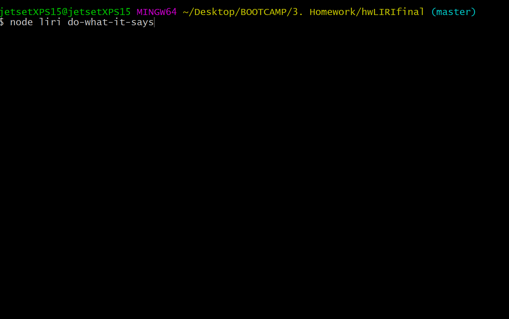
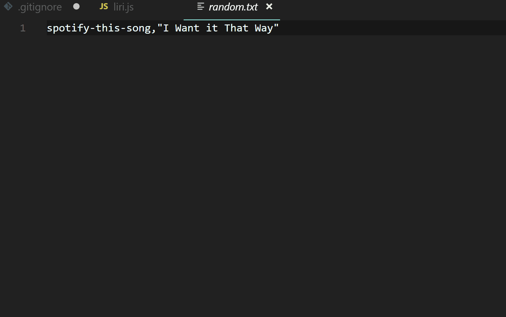

# L.I.R.I. - A curiously designed interface for Language Interpretation and Recognition.

```

     ______    _       ___   ____    ___      ______
    / / / /   | |     |_ _| |  _ \  |_ _|     \ \ \ \
   / / / /    | |      | |  | |_) |  | |       \ \ \ \
   \ \ \ \    | |___ _ | | _|  _ < _ | | _     / / / /
    \_\_\_\   |_____(_)___(_)_| \_(_)___(_)   /_/_/_/
    <<<   L.I.R.I. - powered by: jetsetEngine19™   >>>


```


- How to run app in Bash/Terminal:

```
node liri <command> <search term>
```

- Available \<command>s are:
    ```
       concert-this
       spotify-this-song
       movie-this
       do-what-it-says 
    ```

- "concert-this" command makes LIRI search the Bands in Town API for events related to your search query.

```
node liri concert-this <search term>
```



- "spotify-this-song" command makes LIRI search Spotify for info related to your song search
```
node liri spotify-this-song <song name>
```


If you forgot to enter a \<song name>, LIRI will default to the song "I Saw The Sign" by Ace of Base...


- "movie-this" command makes LIRI search the OMDB API for info related to your movie search
```
node liri movie-this <movie name>
```


If you forgot to enter a \<movie name>, LIRI will default to the movie title "Mr. Nobody".



- "do-what-it-says" command will execute the commands contained in a random.txt file included in this package.
```
node liri do-what-it-says
```
The current command in random.txt is for... 



The random.txt file contents can be changed to any command. For example:

